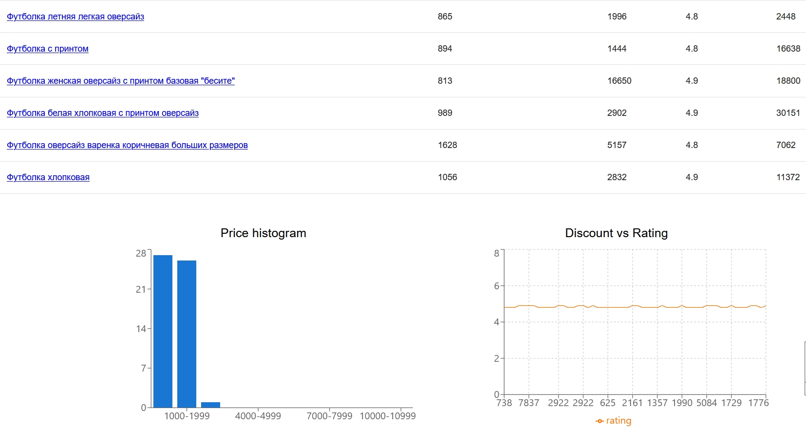

Тестовое задание для кандидата
Цель : Создать простой сервис аналитики товаров с визуализацией данных на фронтенде.

Часть 1: Backend 
Парсер данных :
Написать скрипт для парсинга данных о товарах с сайта Wildberries (категория/запрос вносится пользователем).
Поля: название товара, цена, цена со скидкой, рейтинг, количество отзывов.
Сохранять данные в бд.
API-эндпоинт :
Создать эндпоинт /api/products/ с поддержкой фильтрации:
По цене, рейтингу, количеству отзывов.
Пример запроса: GET /api/products/?min_price=5000&min_rating=4.

Часть 2: Frontend
1. Таблица товаров
• Создать таблицу с колонками:
• Название товара
• Цена
• Цена со скидкой
• Рейтинг
• Количество отзывов
Функционал таблицы :
Фильтры :
• Слайдер для диапазона цен (минимальная цена — максимальная цена).
• Фильтр по минимальному рейтингу (например, от 4.0 и выше).
• Фильтр по минимальному количеству отзывов (например, от 100 и выше).
Сортировка :
По возрастанию/убыванию рейтинга, количеству отзывов, цене, названию
Динамическое обновление: При изменении фильтров таблица должна перерисовываться с учетом новых данных.
2. Диаграммы
Реализовать графики, которые обновляются при изменении фильтров:
Гистограмма цен : Распределение цены vs количество товаров (диапазоны цен выбрать любые).
Линейный график : Размер скидки на товар vs рейтинг товара.
<hr/>




<hr/>

## Инструкция по развертыванию (локально)

Загрузить файлы на сервер в папку, в которой будет храниться сервис.
```
git clone https://github.com/nikolaitolmachev/wildberries.git
```
Открыть терминал и перейти в каталог, куда загружены эти файлы, и выполнить последовательно команды:
```
chmod +x build.sh
./build.sh

chmod +x run.sh
./run.sh
```

Сервис будет доступен по следующим адресам:

    Frontend (React-приложение):
    http://localhost:3000
    Здесь будет доступен пользовательский интерфейс.

    Backend (FastAPI API): 
    http://localhost:8000
    Все запросы с фронтенда к API автоматически проксируются на этот адрес.


